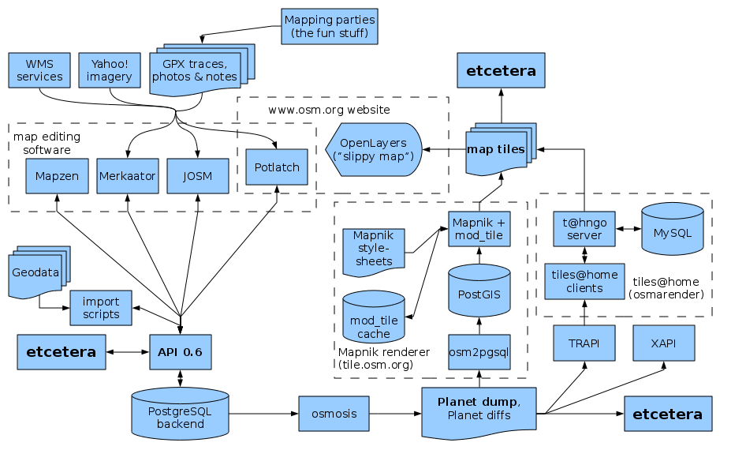
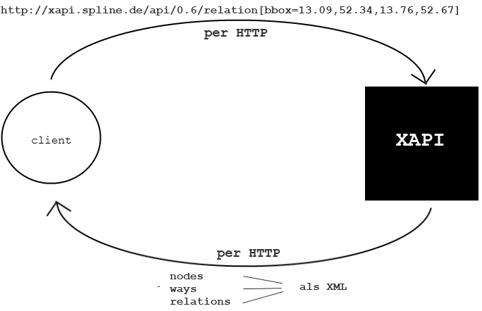

% xappy.js
% Dozentin: Katinka Wolter
% Softwareprojekt Telematik

Übersicht
=========

 

1. Überblick   (Christoph)
2. Gründe für eine Neuimplementierung  (Irena)
3. Implementierung  (Mark)
4. Retrospektive   (Robin)

Team
====

 
 
<table>
<tbody>
<tr>
<td>
           Philipp Borgers
</td>
<td style="width: 200px;">
&nbsp;
</td>
<td>
           Yves Müller
</td>
</tr>
<tr>
<td>
           Lyudmila Vaseva
</td>
<td style="width: 200px;">
&nbsp;
</td>
<td>
           Irena Kpogbezan
</td>
</tr>
<tr>
<td>
           David Hirsch
</td>
<td style="width: 200px;">
&nbsp;
</td>
<td>
           Dario Brand
</td>
</tr>
<tr>
<td>
           Mark Engel
</td>
<td style="width: 200px;">
&nbsp;
</td>
<td>
           Alex Sulfrian
</td>
</tr>
<tr>
<td>
           Robin Nehls
</td>
<td style="width: 200px;">
&nbsp;
</td>
<td>
           Mohammed Keita
</td>
</tr>
<tr>
<td>
           Andreas Nüßlein
</td>
<td style="width: 200px;">
&nbsp;
</td>
<td>
           Mareike Ziese
</td>
</tr>
<tr>
<td>
           Christoph Beuck
</td>
<td style="width: 200px;">
&nbsp;
</td>
<td>
           Max Krüger
</td>
</tr>
</tbody>
</table>

OpenStreetMap
=============
<!--
Begrüßung und Einordnung in das Softwareprojekt Telematik
Unser Projekt behandelt die Xapi, ein OpenStreetMap Projekt
-->

Ziel: freie Geodatenbank und   
&nbsp;&nbsp;&nbsp;&nbsp;&nbsp;&nbsp;&nbsp;&nbsp;lizenzkostenfreie Nutzung für Alle  

<!--
Openstreetmap ist ein Projekt, das freie Geo Daten sammelt und diese
auf verschiedenste Art aufbereitet
-->

OpenStreetMap Infrastruktur
===========================

<!--

vereinfachte componentenübersicht?
wichtige module vorstellen
 - osmosis
 - mapnik
 - ui
 - xapi
-->

Was ist die Xapi
================

<!--

-->

<!--
An diesem Bild die 3 Objekttypen erklären
mit Beispielen

node kann beispielsweise eine bar sein, oder xxx
ways sind intuitiv wege aber auch beispielsweise grundrisse von gebäuden
relations ...

Es gibt Nodes (Punkte) auf der Karte.
Es gibt Wege. Wege bestehen aus geordneten Punkten.
Es gibt Relationen. Relationen bestehen aus Relationen, Wegen und Knodes

Beispiele für jeden Punkt. FU-Berlin Beispiel.

Die Kafete ist ein Punkt.
Wege sind intuitiv alle Straßen.
Aber auch Gebäude sind als Wege gezeichnet (Informatikfakultät)
kompletter Uni Bereich ist eine Relation.
Diese kann wieder Unter Relationen beinhalten (Beispiel)

 gib mir alle Knoten aus

   /*
   /nodes
   /way
   /relation

gib mir alle alle Bars aus

   /nodes[amenity=bar]

 gib mir alle Bars und Clubs aus

   /nodes[amenity=bar|club]

gib mir alle Bars und Clubs in Berlin aus

   /nodes[amenity=bar|club][bbox=x,x,x,x]

-->

Beispiele für XAPI-Anfragen
===========================

 
 
<table >
<tbody>
<tr>
<td style="font-size=12px;width:300px;">
           Anfrage für alle Knoten:
</td>
<td style="font-size=12px;" style="width: 200px;">
&nbsp;
</td>
<td style="font-size=12px;">
           /node
</td>
</tr>
<tr>
<td> </td>
</tr>
<tr>
<td style="font-size=12px;">
           alle Bars:
</td>
<td style="font-size=12px;" style="width: 200px;">
&nbsp;
</td>
<td style="font-size=12px;">
           /node[amenity=bar]
</td>
</tr>
<tr>
<td> </td>
</tr>
<tr>
<td style="font-size=12px;">
           alle Bars und Clubs:
</td>
<td style="font-size=12px;" style="width: 200px;">
&nbsp;
</td>
<td style="font-size=12px;">
           /node[amenity=bar|club]
</td>
</tr>
<tr>
<td> </td>
</tr>
<tr>
<td style="font-size=12px;">
           alle Bars und Clubs in Berlin:
</td>
<td style="font-size=12px;" style="width: 200px;">
&nbsp;
</td>
<td style="font-size=12px;">
           /node[amenity=bar|club][bbox=13.088,52.341,13.760,52.669]
</td>
</tr>
</tbody>
</table>

Für was wird die xapi benutzt
=============================

 - Overlay über bestehende Karten
 - Replikation
 - Anfragen über Editoren
 - Analyse / Statistiken

xappy.js
========

 - Neuimplementierung der XAPI
 - Notwendigkeit?

Codeaussschnitt
===============

    add(sNode)      ; Public ; Add a node
        ; #sNode = stream object containing node
        ;
        n line,nodeId,users,lat,lon,timestamp,user,uid,version,changeset
        ;
        s line=sNode("current")
        ;
        s nodeId=$p($p(line,"id=""",2),"""",1)
        s version=$p($p(line,"version=""",2),"""",1)
        i $g(^nodetag(nodeId,"@version"))>version d  q  ; Don't load older versions
        . i line["/>" q
        . f  d  i line["</node>" q
        . . s line=$$read^stream(.sNode)
        d delete(nodeId)
        ;
        s lat=$p($p(line,"lat=""",2),"""",1)
        s lon=$p($p(line,"lon=""",2),"""",1)
        i lon["e" s lon=+$tr(lon,"e","E")
        s ^node(nodeId)=lat_$c(0)_lon

<!-- rant -->

Warum nodejs
============

- 10000 Verbindungen in der Sekunde
- asynchrone Events
- Streaming

Zielsetzung xappy.js
====================

 - modulares Design
 - Dokumentation
 - getesteter Code 
 - effiziente Implementierung

Zielsetzung für uns
===================

 - freies Softwareprojekt umsetzen
 - agiles Entwickeln
 - testgetriebenes Entwickeln
 - Erschließen und Verwenden von nodejs

Implementierung
===============

simples Implementierungsbild (Parser, Db, Generator)
Grobe Beschreibung des Flußdiagrams

<!--
[img]
-->

Parser
======

Erstellt aus den übergebenen urls Javascript Objekte

<!--
[bild von urlstring -> json]
-->

Datenbankmodul
==============

Fragt Datenbank ab und liefert Ergebnisse

<!--
[bild requestobject -> Datenbank -> responseobject (node, way,relation)]
-->

Emittieren, Streamen

OutputGenerator
===============

Generiert aus den Ergebnissen JSON oder XML

Implementierung mit allen Modules
=========================

Implementierungsbild

Beschreibung des Validators, der mehreren Generatoren, xappy.js, cli.js

Abgefallene Projekte
====================

- whoosh
- postgresmodul
- coverage in unit test implementiert

Arbeitsweise
============

- git
- jenkins
- stories
- scrum
- issues
- standup meetings

Retrospektive
=============

coverage
sloc
git history

<!-- fancy statistiken machen -->

Fazit
=====

- funktionsweise implementiert
- kinderkrankheiten
- releases haben sich bewährt.
- hackweekends bewährt
- blaues club mate brot ist lecker
- fritz cola brot mit zitrone nicht so...
